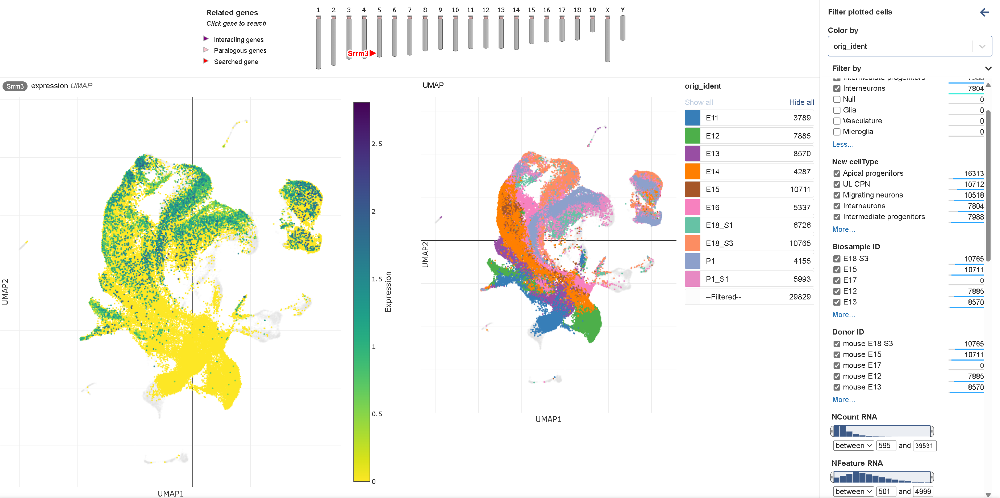

# 

- https://singlecell.broadinstitute.org/single_cell/study/SCP1290/molecular-logic-of-cellular-diversification-in-the-mammalian-cerebral-cortex
- https://github.com/ehsanhabibi/MolecularLogicMouseNeoCortex
