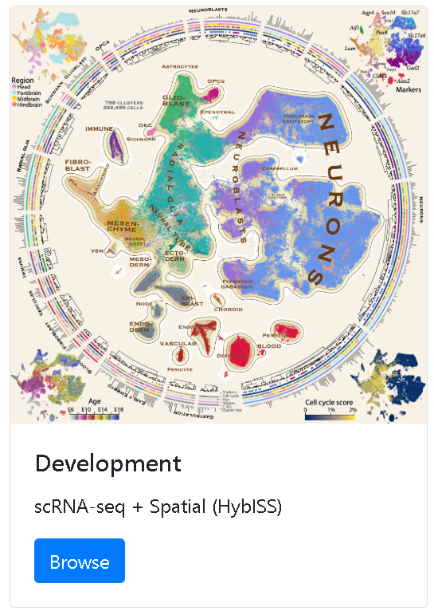

# [Mousebrain.org](http://www.mousebrain.org/)

- [Additional information](http://www.mousebrain.org/development/)
- [Paper - Molecular architecture of the developing mouse brain](https://www.nature.com/articles/s41586-021-03775-x)
- [Datasets - MouseGastrulationData](https://github.com/MarioniLab/MouseGastrulationData)
    - [Analysed in](../EmbryoTimecourse2018)
